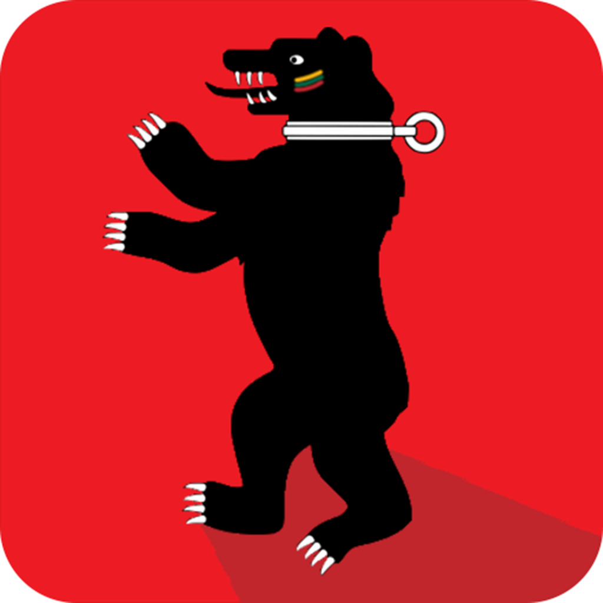

<!-- PROJECT LOGO -->
 

  

  <h3 align="center">Žemaičio žodis</h3>

  

    Lithuanian - samogitian vocabulary. 
     
    <a href="https://github.com/mopixels/Zemaicio-zodis"><strong>Explore the docs »</strong></a>
     
    <a href="https://github.com/mopixels/Zemaicio-zodis/issues">Report Bug</a>
  

<!-- ABOUT THE PROJECT -->

[![Product Name Screen Shot][product-screenshot]](https://play.google.com/store/apps/details?id=com.mopixels.zemaiciozodis)

### Built With

- React Native
- Expo
- React Redux

<!-- CONTACT -->

## Contact

Project Link: [Visit on Google Play](https://play.google.com/store/apps/details?id=com.mopixels.zemaiciozodis)

Modestas Rimkus - [contact me @linkedin](https://www.linkedin.com/in/modestas-rimkus/) - mr.modestasrimkus@gmail.com

<!-- MARKDOWN LINKS & IMAGES -->
<!-- https://www.markdownguide.org/basic-syntax/#reference-style-links -->

[product-screenshot]: https://lh3.googleusercontent.com/2wREGoqSPlq-iVPUmu6dJsHp5Sf3jV58mNox2HpkRp7bwqMpTquGi6Qwq6eijG--kqQ=w720-h310-rw
